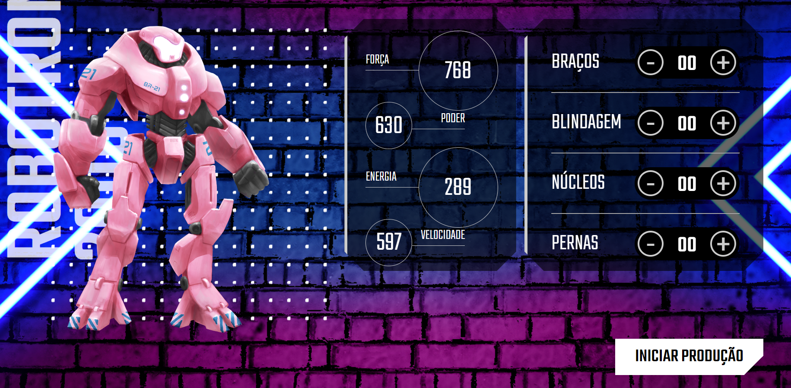

<h1 align="center">

</h1>


<h1 align="center">
Robotron
</h1>

# Indice


- [Sobre](#-sobre)
- [Tecnologias utilizadas](#💻-tecnologias-utilizadas)
- [Como baixar o projeto](#📥-como-baixar-o-projetocomo-baixar-o-projeto)

___

## 📋Sobre


A Terra está sofrendo uma invasão alienígena e você precisa montar o seu robô para juntar as forças de defesa do planeta. Para montar o seu Robotron você precisa adicionar peças na engrenagem que compõe um robô e ver as estatísticas atualizadas dinamicamente, tudo isso com JavaScript.
___


## 💻Tecnologias utilizadas 


O exercício foi desenvolvido utilizando as seguintes tecnologias:

- HTML
- CSS
- JavaScript

___

## 📥 Como baixar o projeto

```bash
    # Clonar o repositório
    $ git clone 
```
